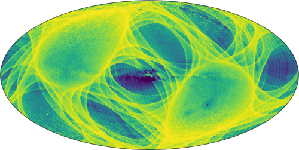

<!--

**Here are some ideas to get you started:**

🙋‍♀️ A short introduction - what is your organization all about?
🌈 Contribution guidelines - how can the community get involved?
👩‍💻 Useful resources - where can the community find your docs? Is there anything else the community should know?
🍿 Fun facts - what does your team eat for breakfast?
🧙 Remember, you can do mighty things with the power of [Markdown](https://docs.github.com/github/writing-on-github/getting-started-with-writing-and-formatting-on-github/basic-writing-and-formatting-syntax)
-->

# Who is In, and Who is Not? Determining the Gaia Survey Selection Function

GaiaUnlimited aims at determining the Gaia survey selection function and providing corresponding data and tools. The GaiaUnlimited project was started at the [2019 Santa Barbara Gaia Sprint](http://gaia.lol/2019SB.html), hosted by the Kavli Institute for Theoretical Physics at the University of California, Santa Barbara.

This project was funded from 2020-01-01 to 2024-09-30 through the European Union's Horizon 2020 research and innovation program under grant agreement No 101004110.

## Team members

### Main contributors

Tristan Cantat-Gaudin (MPIA Heidelberg), 
Alfred Castro-Ginard (Leiden), 
Evgeny Kurbatov (IoA Cambridge), 
Shourya Khanna (INAF-Torino), 
Semyeong Oh (IoA Cambridge),

### Members

Anthony Brown (Leiden, PI), 
Vasily Belokurov (IoA Cambridge), 
Andy Casey (Monash), 
Alex Wallace (Monash), 
Ron Drimmel (INAF-Torino), 
Alessandro Spgna (INAF-Torino), 
Richard Smart (INAF-Torino), 
Eloisa Poggio (INAF-Torino), 
Morgan Fouesneau (MPIA Heidelberg), 
David Hogg (NYU/ Flatiron/ MPIA Heidelberg), 
Adrian Price-Whelan (Flatiron), 
Hans-Walter Rix (MPIA Heidelberg), 
Elena Sellentin (Leiden), 
Douglas Boubert (Oxford), 
Andy Everall (IoA Cambridge), 
